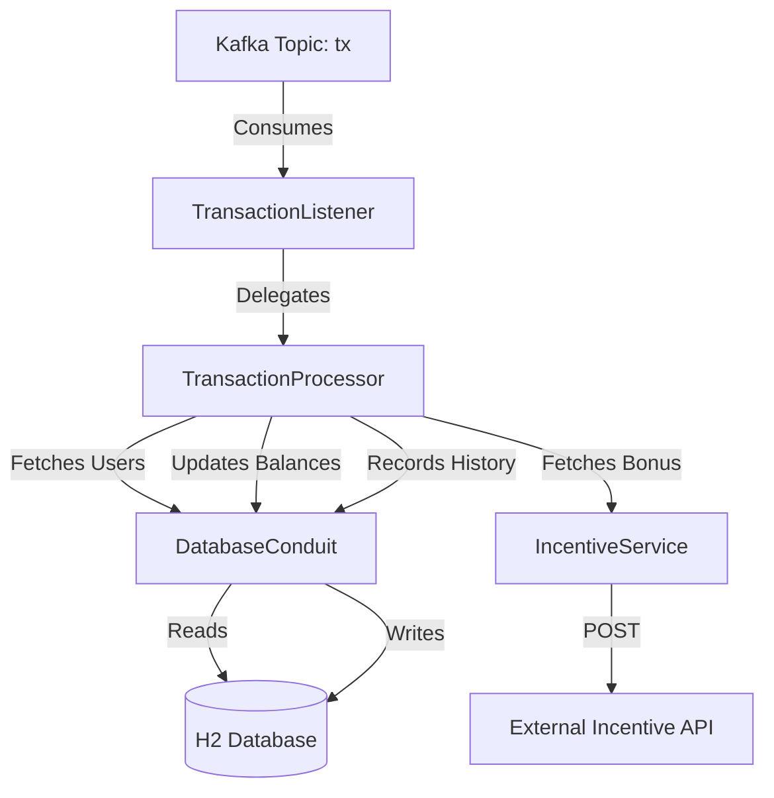

# Midas Core

Midas Core is a robust, event-driven banking application built with **Spring Boot**. It processes financial transactions in real-time using **Apache Kafka** and maintains a secure, persistent ledger using **JPA (H2 Database)**.

## 🚀 Overview

The system is designed to handle high-volume transaction processing with a focus on atomicity, data integrity, and extensibility. It listens for incoming transaction events, validates user balances, applies dynamic incentives via an external service, and maintains a detailed history of all operations.

## 🏗️ Architecture

The following diagram illustrates the flow of a transaction through the system:



## 🛠️ Tech Stack

- **Framework**: Spring Boot 3.2.5
- **Language**: Java 17
- **Messaging**: Apache Kafka 3.1.4
- **Database**: H2 (In-memory for development)
- **Data Access**: Spring Data JPA
- **API Communication**: RestTemplate

## 📂 Project Structure

- `foundation`: Data transfer objects (DTOs) like `Transaction`, `Balance`, and `Incentive`.
- `entity`: JPA entities reflecting the database schema (`UserRecord`, `TransactionRecord`).
- `repository`: Data access interfaces.
- `service`: Core business logic (`TransactionProcessor`, `IncentiveService`).
- `component`: Infrastructure beans like `TransactionListener` and `DatabaseConduit`.
- `controller`: REST endpoints for external interaction (`BalanceController`).

## ⚙️ Key Components

### 1. Transaction Listener
Monitors the configured Kafka topic (`tx`) for incoming `Transaction` objects. It serves as the primary entry point for asynchronous transaction requests.

### 2. Transaction Processor
The "brain" of the application. It ensures:
- **Validation**: Verifies sender and recipient existence and ensures sufficient funds.
- **Atomicity**: Uses `@Transactional` to ensure that balance updates and history recording happen together or not at all.
- **Logic**: Subtracts from sender, adds to recipient, and includes bonuses retrieved from the `IncentiveService`.

### 3. Incentive Service
Communicates with an external REST API to retrieve dynamic bonus amounts for specific transactions, allowing for flexible reward policies without changing core code.

## 🚦 Getting Started

### Prerequisites
- Java 17 or higher
- A running Kafka broker (locally or via Docker)

### Installation
1. Clone the repository.
2. Ensure Kafka is running and a topic named `tx` is created.
3. Run the application using Maven:
   ```bash
   ./mvnw spring-boot:run
   ```

### Configuration
Key settings are located in `application.yml`, including the server port (default 33400) and Kafka configuration.

## 🔗 API Endpoints

| Endpoint | Method | Params | Description |
| :--- | :--- | :--- | :--- |
| `/balance` | `GET` | `userId` | Returns the current balance for a specific user. |
| `/incentive` | `POST` | `Transaction` (Body) | (Internal/Mock) Calculates a 10% bonus for a transaction. |

---
*Created for the JPMC Midas Core forage project.*
